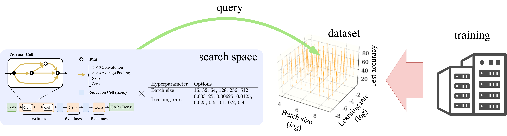
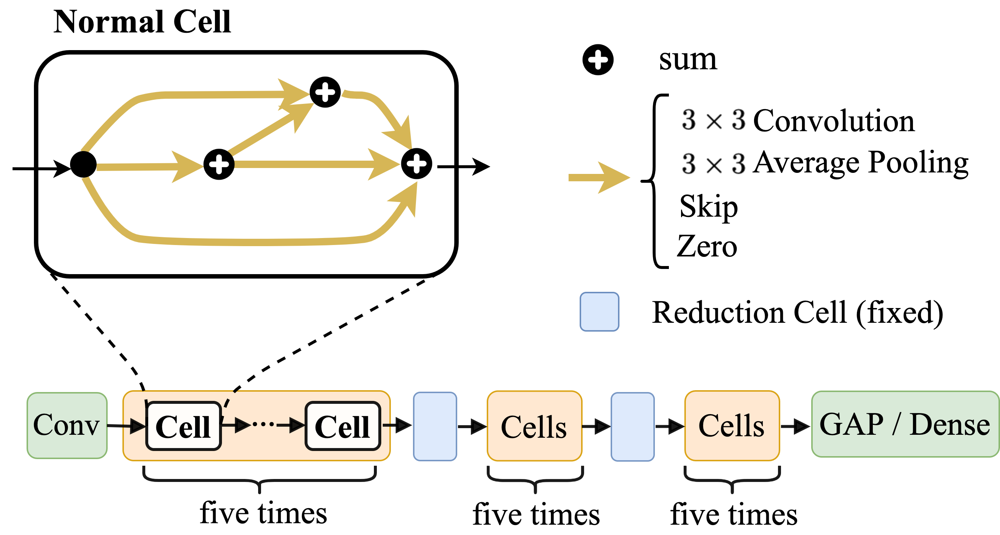
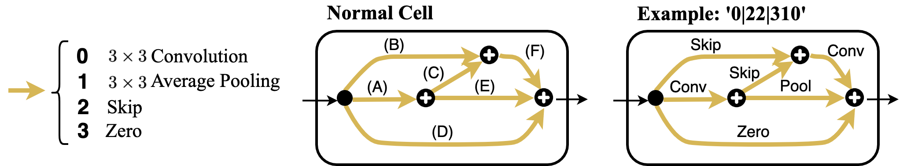

# NAS-HPO-Bench-II API


## Overview

**NAS-HPO-Bench-II** is the first benchmark dataset for joint optimization of CNN and training HPs.

It helps

* **a fair and low-cost evaluation/comparison** of joint optimization (NAS+HPO) methods
* **a detailed analysis** of the relationship between architecture/training HPs and performances

Our experimental analysis supports **the importance of joint optimization**.
Please see [our paper](http://www.acml-conf.org/2021/conference/accepted-papers/452/) for details.

This repo provides **API** for NAS-HPO-Bench-II to make benchmarking easy.
You can **query our data when evaluating models** in the search process of AutoML methods **instead of training the models at a high cost**.

</img>

If you use the dataset, please cite:

```
@InProceedings{hirose2021bench,
  title={{NAS-HPO-Bench-II}: A Benchmark Dataset on Joint Optimization of Convolutional Neural Network Architecture and Training Hyperparameters},
  author={Hirose, Yoichi and Yoshinari, Nozomu and Shirakawa,  Shinichi},
  booktitle={Proceedings of the 13th Asian Conference on Machine Learning},
  year={2021}
}
```

The code for training models is [here](https://github.com/yoichii/nashpobench2).

## Dataset Overview

The total size of the search space is **192K**.
The dataset includes

* the exact data of all the models in the search space for 12 epoch training
* the surrogate data predicting accuracies after 200 epoch training

### Architecture Search Space

The overall CNN architecture is constructed by **stacking cells** represented as a directed acyclic graph (DAG).
Each edge in the graph indicates one of the four operations.

* **3x3 convolution** (ReLU activation, 3x3 convolution with stride 1, then batch normalization)
* **3x3 average pooling** with stride 1
* **Skip**, which outputs the input tensor
* **Zero**, which outputs the zero tensor with the same dimension as the input

It is based on [NAS-Bench-201](https://arxiv.org/abs/2001.00326) and the only difference is that we exclude the 1x1 convolution operation from the options.

</img>

### Training HP Search Space

The combination of **eight initial learning rates** and **six batch sizes** are used.

| Hyperparameter | Options                                               |
| -------------- | ----------------------------------------------------- |
| Batch Size     | 16, 32, 64, 128, 256, 512                             |
| Learning Rate  | 0.003125, 0.00625, 0.0125, 0.025, 0.05, 0.1, 0.2, 0.4 |


## Installation

Run

```
pip install nashpobench2api
```

, and download the API dataset from [Google Drive](https://drive.google.com/drive/folders/1sxnBo5A6WXxt44WQG8f8WlYYicKd9g-h?usp=sharing) (93.7MB), then put the data in some directory (default: ./data).
This API supports python >= 3.6 (and no external library dependencies).

If you want to run the codes in [bench_algos](bench_algos), run `pip install -r requirements.txt`.


## Getting Started

Create an API instance to get access to the dataset.

```
from nashpobench2api import NASHPOBench2API as API
api = API('/path/to/dataset')
```

You can get 12-epoch valid accuracy (%) and train+valid training cost (sec.) of the specified configuration.

```
acc, cost = api.query_by_key(
	cellcode='0|10|210',
	batch_size=256,
	lr=0.1 )
```

Here, `cellcode` represents one of the architectures in the search space. As shown in the figure below, the numbers in the cellcode mean the type of operations, and the position of the numbers shows the edge '(A) | (B)(C) | (D)(E)(F)'.

</img>

In the querying process, the  `api` instance remembers and shows the log (what you have queried). 
You can reduce the log if set `verbose=False` when initializing `api`.

When the querying process has finished, you can get the test accuracy of the configuration with the best valid accuracy in the queried configurations.

```
results = api.get_results()
```

`results` is a dictionary with the keys below.

| Key              | Explanation                                                  |
| ---------------- | ------------------------------------------------------------ |
| acc_trans        | a transition of valid  accuracies `api` have queried         |
| key_trans        | a transition of keys (=cellcode, lr, batch_size) `api` have queried |
| best_acc_trans   | a transition of the best valid accuracies (%) `api` have queried |
| best_key_trans   | a transition of the best keys (=cellcode, lr, batch_size)  `api` have queried |
| total_cost_trans | a transition of train+valid costs (sec.)                     |
| final_accs       | 12-epoch and 200-epoch test accuracies (%) of the key with the best valid accuracy `api` have queried |

You can reset what `api` have remebered, which is useful when multiple runs.

```
api.reset_log_data()
```

The examples of benchmarking codes are in the [bench_algos](./bench_algos) directory.
Especially, `random_search.py` is the simplest code and easy to understand (the core part is `random_search()`).

## Work in Progress

* Upload the dataset as DataFrame for visualization/analysis.
* Upload codes for a surrogate model.
* Upload the trained models.
